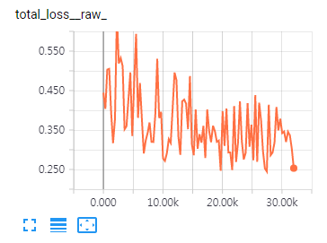

# R-MAC Triplet network 1차 결과

1차 결과는 부정적임. 육안으로 확인 해도 classification보다 결과가 안나옴.

## network 정보
   1. input size : 500 x 500
   2. 이미지 forward, backward 시간 약 3.6~3.8초
   3. 100 epoch 학습
   3. 각 유사 이미지 셋에서 anchor를 선택 후 positive set으로 유사이미지를 랜덤으로 선택, negative set으로 다른 셋 이미지를 선택

## loss graph

## 부정적인 결과 원인 추측

   1. 네트워크 부정확성 
      - l2 norm, drop out 추가해봐야 될 듯. 다른 논문의 네트워크에서 embedding fully connected를 하거나 뭔가 특징을 취합하기 전에 l2 norm 처리를 하였음. 하지만 1차는 결과만 l2 norm적용
   2. proposals 와 features
      - 임의로 ( 내기준으로 .. ) proposals 을 생성했다. 12개 ( 원본, 정사각형 (좌상단, 우상단, 좌하단, 우하단, 센터), 가로사각형 ( 상, 중, 하 ), 세로 사각형 ( 상, 중, 하 ). 이 proposals이 패션 이미지의 특징을 잘 추출하지 못했기 때문이라 판단한다. proposals의 형태를 다양하게 더 추가..
      -  그리고 현재 conv5의 특징을 사용하지만 conv4의 특징도 추가하면 더 좋지 않을까..
   3. triplet datasets
      - 의심하면 한도 끝도 없는 데이터 셋...
   4. eval 추가
      - eval set을 구성해서 학습 중 eval결과 추이를 확인해야겠음..
      
## 다른 논문의 아이디어
   1. Learning Fine-grained Image Similarity with Deep Ranking
      - 이 논문에서 hard negative sampling을 언급 하였다. R-MAC도 hardnegative sampling을 언급 하였다.
        > 추가 조건 ri,i+ − ri,i− ≥ Tr, ∀ti = (pi, p+i, p−i)
      - 그리고 regulization을 신경쓴듯. weight decay와 drop out을 언급 수치까지.. 데이터 셋이 많은데 regulization을 신경쓴거 보면 비슷한 이미지를 잘 나누려고 학습하다 보면 overfit이 생기나 봄
      - 다른 레이어의 feature를 사용함. 하지만 이 논문에선 proposals을 사용하지 않음.
